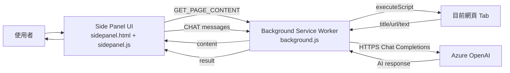

# Chatter Extension 功能與架構說明

## 1. 這個 Extension 在做什麼
`Chatter` 是一個 Chrome Extension（Manifest V3），主要用途是：
1. 擷取目前網頁文字內容（或讀取剪貼簿文字）。
2. 把內容當成上下文送到 Azure OpenAI（GPT-4o 部署）。
3. 讓使用者在 Side Panel 內用自然語言持續提問。
4. 支援多語言介面與回答語言（繁中、簡中、英文）。

簡單說，它是「針對網頁/文字內容的 AI 問答助手」。

---

## 2. 專案檔案與職責

### `manifest.json`
- 宣告為 `manifest_version: 3`。
- 註冊：
  - `background.service_worker = background.js`
  - `side_panel.default_path = sidepanel.html`
  - `options_page = options.html`
- 權限：
  - `activeTab`: 取得目前分頁資訊
  - `scripting`: 注入程式抓取頁面內容
  - `storage`: 儲存語言偏好
  - `sidePanel`: 使用 Chrome 側邊欄
  - `clipboardRead`: 讀取剪貼簿
- `host_permissions: <all_urls>`：允許在所有網站頁面抓內容。

### `background.js`（Service Worker）
核心後端邏輯：
- 監聽工具列按鈕點擊，開啟 side panel。
- 提供 `GET_PAGE_CONTENT` 訊息處理：
  - 透過 `chrome.scripting.executeScript` 在頁面端取 `document.body.innerText`。
  - 同時取 `title`、`url`。
  - 最長截斷到 15000 字元，避免 prompt 過長。
- 提供 `CHAT` 訊息處理：
  - 根據語言注入 system prompt。
  - 呼叫 Azure OpenAI Chat Completions API。
  - 回傳模型結果給 side panel。

### `sidepanel.html`
- 聊天 UI 主畫面（header、狀態列、頁面資訊、訊息區、輸入框）。
- 按鈕：`清除對話`、`載入網頁`、`載入剪貼簿`、語言切換、`發送`。

### `sidepanel.js`
前端互動控制：
- i18n 字典（`zh-TW` / `zh-CN` / `en`）與 UI 語言切換。
- `loadPage()`：向 background 要求抓目前分頁內容。
- `loadClipboard()`：讀剪貼簿文字作為上下文。
- `sendMessage()`：組裝訊息歷史與頁面內容後送 `CHAT`。
- `clearChat()`：清除歷史與目前上下文。
- 管理狀態燈號與錯誤訊息。

### `options.html`
- 靜態說明頁，展示目前使用的 Azure OpenAI endpoint/deployment/api version 與使用說明。

### `README.md`
- 專案功能、操作流程、架構概覽與版本資訊。

---

## 3. 執行流程（重要）

### A. 載入網頁內容流程
1. 使用者點 `載入網頁`（`sidepanel.js`）。
2. Side panel 透過 `chrome.runtime.sendMessage` 傳 `GET_PAGE_CONTENT` 到 `background.js`。
3. `background.js` 用 `chrome.scripting.executeScript` 到目標 tab 抓文字。
4. 回傳 `{ title, url, text }` 給 side panel。
5. Side panel 顯示頁面資訊，並把該內容保存在 `pageContent`。

### B. 發問流程
1. 使用者輸入問題，點 `發送`。
2. `sidepanel.js` 組裝 `apiMessages`：
   - 第一次提問：把頁面內容與問題放在同一則 user message。
   - 後續提問：附上頁面內容、固定 assistant acknowledgement、歷史對話、本次問題。
3. 傳 `CHAT` 訊息到 `background.js`。
4. `background.js` 呼叫 Azure OpenAI，並回傳回答。
5. Side panel 更新聊天畫面與本地 `messages` 歷史。

---

## 4. 架構圖（邏輯）

---

## 5. 狀態與資料模型

### Side Panel 主要狀態
- `currentLanguage`: 目前語言（預設 `zh-TW`，可存入 `chrome.storage.local`）。
- `messages`: 對話歷史（user/assistant 交替）。
- `pageContent`: 當前上下文來源（網頁或剪貼簿）。

### Background 主要設定
- `INTEL_AZURE_CONFIG`：endpoint、apiKey、deployment、apiVersion。
- `SYSTEM_PROMPTS`：三種語言對應 system prompt。

---

## 6. 權限與安全觀察

### 已使用的高敏感權限
- `<all_urls>` + `scripting`：可讀所有網站文字內容。
- `clipboardRead`：可讀使用者剪貼簿。

### 目前實作上的風險
1. `background.js` 內含硬編碼 API Key（高風險，任何取得 extension 原始碼的人都可能外流憑證）。
2. 頁面全文可能包含敏感資訊，送到外部 AI 服務需符合公司資料治理政策。
3. 使用 `<all_urls>` 權限範圍很大，若只需特定網站，建議縮小範圍。

---

## 7. 你可以如何理解這個專案

若用一句話總結：
- `sidepanel.js` 負責「人機互動」。
- `background.js` 負責「取內容 + 打 API」。
- `manifest.json` 負責「把權限與元件接起來」。

先看 `sidepanel.js` 的三個函式：`loadPage()`、`loadClipboard()`、`sendMessage()`，就能掌握 80% 主要邏輯。

---

## 8. 後續可優化方向（建議）
1. 把 API Key 移到後端服務，不要放在 extension 前端程式。
2. 增加內容遮罩/脫敏策略（例如 email、token、ID 自動移除）。
3. 對超長頁面改為分段摘要，而不是硬截斷 15000 字。
4. 增加錯誤分類（網路錯誤、授權錯誤、速率限制）提升可維護性。
5. 加入基礎測試（訊息組裝、語言切換、錯誤處理）。
